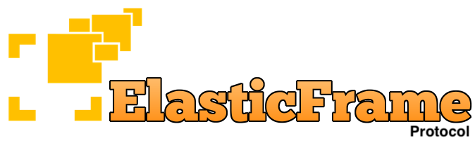

# ElasticFrameProtocol

The ElasticFrameProtocol is acting as a bridge between elementary data and the underlying transport protocol.

```
---------------------------------------------------------   /\
| Data type L | Data type L | Data type F | Data type Q |  /  \
---------------------------------------------------------   ||
|                   ElasticFrameProtocol                |   ||
---------------------------------------------------------   ||
| Network layer: UDP, TCP, SRT, RIST, Zixi, SCTP, aso.  |  \  /
---------------------------------------------------------   \/

```

The elasticity comes from the protocols ability to adapt to incoming frame size, type, number of concurrent streams and underlying infrastructure. The layer between the transport layer and producers/consumers of the data can be kept thin without driving overhead, complexity and delay. 

Please read -> [**ElasticFrameProtocol**](https://edgeware-my.sharepoint.com/:p:/g/personal/anders_cedronius_edgeware_tv/ERnSit7j6udBsZOqkQcMLrQBpKmnfdApG3lehRk4zE-qgQ?e=Ha2VrP) for more information.

## Current build status

 **(MacOS build)**

 **(Windows 10 build)**

 **(Ubuntu build)**

## Installation

Requires cmake version >= **3.10** and **C++14**

**Release:**

```sh
mkdir build
cd build
cmake -DCMAKE_BUILD_TYPE=Release ..
cmake --build . --config Release
```

***Debug:***

```sh
mkdir build
cd build
cmake -DCMAKE_BUILD_TYPE=Debug ..
cmake --build . --config Debug
```

Output: 

**(platform specific)efp.(platform specific)** (Linux/MacOS -> libefp.a)

The static EFP library 

**(platform specific)efp_shared.(platform specific)** 

The dynamic EFP library 

**efptests**

*efptests* (executable) runs trough the unit tests and returns EXIT_SUCESS if all unit tests pass.

---

**EFP** Is built on Ubuntu, Windows10 and MacOS every commit by us.
 

---


## Usage

The EFP class/library can be made a reciever or sender. This is configured during creation as decribed below.

**Sender:**

```cpp
// The callback function referenced as 'sendCallback'
void sendData(const std::vector<uint8_t> &subPacket, uint8_t streamID) {
// Send the subPacket data 
// UDP.send(subPacket);
}

// The data to be sent
std::vector<uint8_t> myData;

// Create your sender passing the MTU of the underlying protocol.
ElasticFrameProtocolSender myEFPSender(MTU);

// Register your callback sending the packets
// The callback will be called on the same thread calling 'packAndSend'
//optionally also a std::placeholders::_2 if you want the EFP streamID
myEFPSender.sendCallback = std::bind(&sendData, std::placeholders::_1, std::placeholders::_2);

// Send the data
// param1 = The data
// param2 = The data type
// param3 = PTS
// param4 = DTS
// param5 = CODE (if the data type param2 (uint8_t) msb is set then CODE must be used
// See the header file detailing what CODE should be set to
// param6 = Stream number (uint8_t) a unique value for that EFP-Stream
// param7 = FLAGS (used for various signaling in the protocol) 
myEFPSender.packAndSend(myData, ElasticFrameContent::h264, 0, 0, EFP_CODE('A', 'N', 'X', 'B'), 2, NO_FLAGS);

//If you got your data as a pointer there is also the method 'packAndSendFromPtr' so you don't need to copy your data into a vector first.


```

**Reciever:**

```cpp

// The callback function referenced as 'receiveCallback'
// This callback will be called from a separate thread owned by EFP
// rFrame is a pointer to the data object
// Containing:
// pFrameData pointer to the data
// mFrameSize Size of the data 
// mDataContent is containing the content descriptor
// mBroken is true if data in the superFrame is missing
// mPts contains the pts value used in the superFrame
// mDts contains the pts value used in the superFrame
// mCode contains the code sent (if used)
// mStream is the stream number to associate to the data
// mFlags contains the flags used by the superFrame
void gotData(ElasticFrameProtocol::pFramePtr &rFrame)
{
			// Use the data in your application 
}

// Create your receiver
// Passing fragment time out and HOL time out if wanted else set HOL to 0
ElasticFrameProtocolReceiver myEFPReceiver(5, 2);

// Register the callback
myEFPReceiver.receiveCallback = std::bind(&gotData, std::placeholders::_1);

// Receive a EFP fragment
myEFPReceiver.receiveFragment(subPacket,0);

//If you got your data as a pointer there is also the method 'receiveFragmentFromPtr' so you don't need to copy your data into a vector first.

```

## Using EFP in your CMake project

* **Step1** 

Add this in your CMake file.

```
#Include EFP
include(ExternalProject)
ExternalProject_Add(project_efp
        GIT_REPOSITORY https://github.com/Unit-X/efp.git
        GIT_SUBMODULES ""
        SOURCE_DIR ${CMAKE_CURRENT_SOURCE_DIR}/efp
        BINARY_DIR ${CMAKE_CURRENT_SOURCE_DIR}/efp
        GIT_PROGRESS 1
        BUILD_COMMAND cmake --build ${CMAKE_CURRENT_SOURCE_DIR}/efp --config ${CMAKE_BUILD_TYPE} --target efp
        STEP_TARGETS build
        EXCLUDE_FROM_ALL TRUE
        INSTALL_COMMAND ""
        )
add_library(efp STATIC IMPORTED)
set_property(TARGET efp PROPERTY IMPORTED_LOCATION ${CMAKE_CURRENT_SOURCE_DIR}/efp/libefp.a)
add_dependencies(efp project_efp)
include_directories(${CMAKE_CURRENT_SOURCE_DIR}/efp/)
```

* **Step2**

Link your library or executable.

```
target_link_libraries((your target) efp (the rest you want to link)) 
```

* **Step3** 

Add header file to your project.

```
#include "ElasticFrameProtocol.h"
```

You should now be able to use EFP in your project and use any CMake supported IDE

## Plug-in

EFP is all about framing data and checking the integrity of the content. For other functionality EFP uses plug-ins. Available plug-ins are listed below.

[**EFPBonding**](https://github.com/Unit-X/efpbond)

EFPBond makes it possible for all streams to use multiple underlying transport interfaces for protection or to increase the capacity. 

[**EFPSignal**](https://github.com/Unit-X/efpsignal)

EFPSignal adds signaling, content declaration and dynamic/static subscription to EFP-Streams.  

## Contributing

1. Fork it!
2. Create your feature branch: `git checkout -b my-new-feature`
3. Make your additions and write a UnitTest testing it/them.
4. Commit your changes: `git commit -am 'Add some feature'`
5. Push to the branch: `git push origin my-new-feature`
6. Submit a pull request :D

## History

When working with media workflows, both live and non-live, we use framing protocols such as MP4 and MPEG-TS, often transported over HTTP (TCP). Some of the protocols used for media transport are also tied to a certain underlying transport mechanism (RTMP, HLS, WebRTC…), and some are agnostic to the underlying transport (MP4, MPEG-TS…). The protocols tied to an underlying transport type forces the user to the behavior of that protocol’s properties, for example, TCP when using RTMP. If you use MP4 as framing agnostic to the underlying transport and then transport the data using a protocol where you might lose data and the delivery might be out of order, there is no mechanism to correct for that in the MP4-box domain.  

For those situations, MPEG-TS has traditionally been used and is a common multiplexing standard for media. However, MPEG-TS, was designed in the mid ’90s for the transport of media over ATM networks and was later also heavily used in the serial ASI interface. MPEG-TS solved a lot of transport problems in the 1990’s where simplex transport was common and data integrity looked different. However, MPEG-TS has not changed since then, it does not match modern IP protocols well and it has a high protocol overhead. Some of today’s underlying transport protocols also lose data and there might be out of order delivery of data. MPEG-TS was not built to handle that type of delivery behavior. 

There has been work done in the MPEG group to modernize media/data framing using MMT (MPEG Media Transport) for better adaption against underlying transport. MMT is currently used in the ATSC 3.0 standard but has not gained popularity in the data center/cloud/internet domain. 

Another common solution to cover for a protocol’s shortcomings is to stack protocols and framing structures on top of each other. However, this drives complexity to the solution, ads overhead and sometimes delay. Many implementations are closed source and, if they aren’t, they are often of license types that are unwanted in commercial products.  

Now with the rise of protocols such as RIST, Zixi, and SRT we wanted to fully utilize the transport containers with as little overhead as possible, so we implemented a thin network adaptation layer that allows us to easily use different transport protocols where they make most sense maintaining a well-defined data delivery pipeline to and from the data producers/consumers. 

That’s why we developed ElasticFrameProtocol, we are so enthusiastic about where RIST, Zixi, and SRT is taking the future of broadcast. There are new open source projects putting these building blocks together, creating new ways of working and transporting media all the time.  We would like to simplify the way of building media solutions even more by open sourcing the layer on top of the transport protocols so that you can focus on developing great services instead.  

Please feel free to use, clone / fork and contribute to this new way of interconnecting media services between datacenters, internet and private networks in your next project or lab. 


## Examples


1. A client/server using EFP over SRT

[EFP + SRT Client/Server](https://github.com/Unit-X/efp_srt_example)

2. A example showing how to use the EBPBond plug-in 

[EFP + EFPBond + SRT](https://github.com/Unit-X/efp_srt_bonding_example)

3. A simple example showing how to map UDP -> MPEG-TS -> EFP

[UDP -> MPEG-TS -> EFP](https://github.com/Unit-X/ts2efp)


## Next steps

* Add opportunistic embedded data
* Write more examples
* Write more unit-tests

## Credits

The UnitX team at Edgeware AB

Maintainer: anders.cedronius(at)edgeware.tv


## License

*MIT*

Read *LICENCE.md* for details